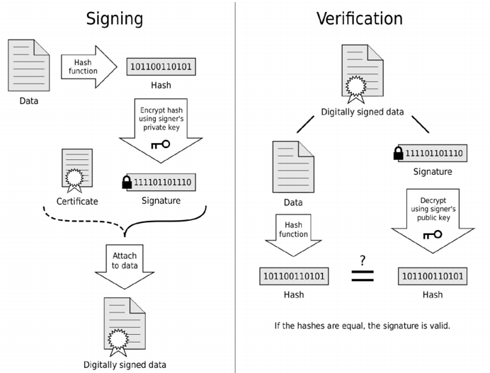

# Funktionsprinzip

Digitale Signaturen oftmals auch mit \(s\) Abgekürzt, beschreiben somit ein Grundprinzip, indem man aus einer Nachricht \(x\) als Input mittels Algorithmus \(z.B RSA, Elgamal oder ECC\) eine Art Unterschrift, sprich die Signatur berechnet. Diese Signatur bestätigt schlussendlich, dass die Nachricht von einem bestimmten Absender kommt.

Digitale Signaturen haben in drei Aufgaben:

1. Beweist, dass jemand der Besitzer eines Private Key ist und z.B Coins ausgeben oder einen Smart Contract auslösen darf
2. Garantiert keine Zurückweisung der Nachricht
3. Bewiest, dass die Daten nicht manipuliert wurden

Digitale Signaturen bestehen aus zwei Teilen:

1. Algorithmus der die Signatur erstellt
2. Algorithmus der jedem ermöglicht mittels Nachricht und Public Key die Signatur zu bestätigen

Im folgenden Beispiel sieht man den exemplarischen Ablauf sehr schön dargestellt. Die Nachricht \(data\) wird hier noch durch eine Hash Funktion verschlüsselt, was im Kapitel[ Hash Funktionen ](../../hash-funktionen/wie-wird-ein-hash-gebildet.md)genauer angeschaut wird.

**Erstellt** wird die digitale Signatur in dem man die Nachricht \(data\) oder den Hash der Nachricht \(Hash\) nimmt und mit dem Private Key des Senders verschlüsselt. Man unterschreibt quasi die Daten. Bei Bitcoin wird dies durch das Wallet vorgenommen.

**Verschickt** wird die Signatur zusammen mit der Nachricht. Die Signatur wir an die der Nachricht angehängt und als Paar an den Empfänger geschickt \(digital signed data\). Die digitale Signatur ist wertlos, wenn sie ohne die dazugehörige Nachricht verschickt wird. Die Nachricht kann dabei als Klartext oder auch verschlüsselt verschickt werden.

**Verifiziert** wird die Signatur in dem man überprüft, **ob die Signatur mit dem öffentlichen Public Key des Senders reproduziert werden kann**. Vereinfacht kann man sich das so vorstellen, dass der Sender die Nachricht \(data\) auf eine bestimmte Art und Weise mit dem Private Key "erweitert" hat. Dank der asymmetrischen Kryptografie, sollte man nun diese "Erweiterung" wieder entfernen können um wieder die original Nachricht \(data\) zu erhalten. Dieses "entfernen" wird mit dem öffentlichen Public Key des gleichen Senders gemacht. Wurde der Public Key mit dem Privat Key des Senders erstellt, kann das "entfernen"  mit dem Public Key, dank der asymmetrischen Kryptografie gemacht werden. Handelt sich beim Public Key um einen Key der **nicht** vom Private Key des Senders erstellt wurde, scheitert das vorhaben. Man spricht hier auch davon, dass der Private Key den Public Key kontrolliert.

Zusammengefasst heisst das:

* Nur "ich" als Sender kann die digitale Signatur \(unterschreiben\) erstellen, aber jeder kann verifizieren
* Die Signatur ist gebunden an die jeweiligen Daten und kann nicht global verwendet werden

Im Falle von Bitcoin werden die beiden Skripte **scriptPubKey** und **scriptSig** verkettet und auf dem Stack abgearbeitet. Diese Skripte verifizieren und erweitern den UTXO und geben als Resultat TRUE oder FALSE raus. TRUE bedeutet, dass die Transaktion korrekt signiert wurde und die Bitcoins auch dem Sender gehören. Es wird hier nicht weiter auf das Prinzip und die Algorithmen eingegangen und auf gängige Literatur verwiesen.

