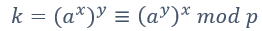

# Der Diffie-Hellmann Algorithmus

Das Prinzip beruht auf der wesentlichen Idee des Potenzierens einer Primzahl **p** und dadurch eine Einwegfunktion darstellt.

**Das Ziel ist, dass zwei Parteien über einen unsicheren Kanal einen gemeinsamen, geheimen Schlüssel definieren**. 

Der Wert **k** ist das gemeinsame Geheimnis, das anschliessend als Sitzungsschlüssel \(z.B in symmetrischen Algorithmen\) zwischen den beiden Parteien verwendet werden kann. Dabei wird unterschieden zwischen:

* **Schlüsseltransport:** Beide Parteien \(Sender und Empfänger\) erzeugen einen Schlüssel, der dann zum anderen Teilnehmer transportiert wird
* **Schlüsselvereinbarung:** Beide Parteien \(Sender und Empfänger\)

  erzeugen den Schlüssel gemeinsam \(Diffie-Hellmann Schlüsselaustausch\)

