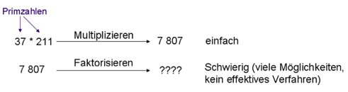

# Einwegfunktionen

Die asymmetrische Kryptografie basiert auf der mathematischen Einwegfunktion und stützt sich dabei darauf, dass es rechentechnisch einfach ist etas zu erstellen aber unmöglich zurückzurechnen auf den Ursprung. 

Man kann sich das bildlich so vorstellen, dass man aus einem Ei sehr einfach ein kaputtes Ei machen kann, aber umgekehrt wird es sehr sehr schwer.

Technisch vereinfacht gesprochen werden zum Beispiel zwei beliebige Primzahlen multipliziert. 

Hätte man nur das Produkt, im obigen Beisipel 7807 \(Nachricht welche verschickt wird\) welches in seine ursprünglichen Primfaktoren zerlegt werden soll \(Entschlüsselung\), wird man sehr schnell verzweifeln, da es nicht nur viele Möglichkeiten, sondern auch kein effektives Verfahren dafür gibt. 

Trotz unseres Fortschritts hat die heutige Mathematik noch kein Verfahren oder Algorithmus zur schnellen Faktorisierung entdeckt, was die asymmetrischen Verfahren unsicher machen würde.


Man verwendet in der asymmetrischen Kryptografie also ein mathematisches Paradoxen welches darauf beruht, mit nur sehr vielen und teuren Ressourcen, eventuell gebrochen werden zu können.


In der Praxis verwendet man noch viel grössere Zahlen zur Berechnung was das Brechen der Kryptografie scheinbar unmöglich macht.

Es gibt heute zwei-ein-halb solcher Einwegfunktionen oder Algorithmen welche in den nachfolgenden Kapiteln angeschaut werden:

* **Faktorisierungsproblem \(RSA\):** Aus zwei gegeben Primzahlen ist es einfach das Produkt zu berechnen. Es ist jedoch sehr schwierig, ein gegebenes Produkt aus zwei Primzahlen zu faktorisieren \(zerlegen in nicht triviale Faktoren\). Grosse Zahlen welche nur wenige Primzahlen haben zu faktorisieren ist schwierig.
* **diskretes Logarithmusproblem \(DLP\)**: Die Umkehrfunktion des diskreten Logarithmus, die diskrete Exponentialfunktion lässt sich leicht berechnen im Gegensatz zum diskreten Logarithmus und stellt somit eine Einwegfunktion dar.
* **Elliptische Kurven \(Teil von diskretem Log Problem\)**: Verallgemeinerung des diskreten Logarithmusproblems

