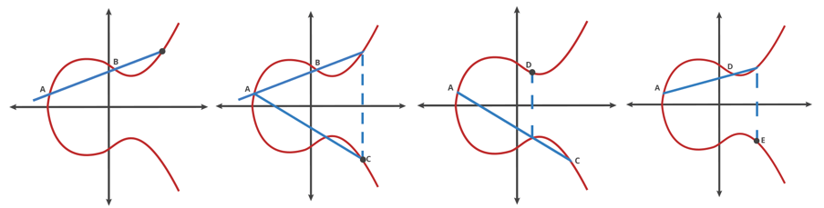

# Anwendung der Elliptischen Kurve Kryptografie

Hier wird erklärt wie man mittels Elliptischen Kurven einen Punkt berechnen kann und schlussendliche eine sehr starke aber effiziente Einwegfunktion darstellt. 

Zum Besipiel für die Berechnung von digitalen Signaturen \(Elliptic Curve Digital Signature Algorithm - ECDSA\) um wie in den vorherigen Kapitel beschrieben, das Problem der Echtheit des Senders zu gewährleisten. Digitale Signaturen werden später in im Kapitel [digitale Signaturen](../digitale-signaturen.md) beschrieben. 


Bei Bitcoin zum Beispiel wird die Elliptische Kurven Kryptografie \(ECC\) auch verwendet um aus dem Private Key den Public Key zu erstellen. Der Endpunkt den man nach der Berechnung erreicht ist der Public Key. Mehr dazu in späteren Kapiteln. 


Folgende Parameter sind wichtig:

* Primzahl als Maximale Anzahl an Sprüngen
* Eine mathematische Beschreibung \(Formel\) der Elliptischen Kurve
* Ein Startpunkt \(Public Point oder generator point\) auf der elliptischen Kurve

1.    Man zeichnet eine gerade Linie vom Startpunkt A zu einem beliebigen Punk B. Bei elliptischen Kurven schneidet sich die Gerade exakt an einem zweiten Punk.

2.    Dieser neue Schnittpunkt wird an der x-Achse gespiegelt und ergibt einen neun Punkt C. Man sagt dann: A + B = C

3.    Danach verbindet man diesen neuen Punkt C mit dem Startpunkt A und es ergibt sich wiederum ein neuer Schnittpunkt der an der x-Achse gespiegelt wird und woraus der neue Punkt D entsteht

4.    Zieht man wieder eine Linie zum Startpunkt A und spiegelt den Schnittpunkt an der x-Achse ergibt dies den neuen Punkt E.

Der Prozess wiederholt sich **n** mal, wobei **n** der Private Key als Zahl ist. Der Public Key ist schlussendlich der Endpunkt nach n-Mal ausführen des Prozesses. 

In unserem obigen Beispiel wäre der Public Key der Punkt E. Dieser Punkt E hat eine x- und y Koordinate welche zusammengeführt den Public Key ergeben.

Jede Person welche die gleichen Kurvenfunktion \(z.B secp256k1\) hat als Startpunkt den gleichen Punkt, da dieser Punkt in der Definition vom US National Institute of Standards and Technolgy \(NIST\) festgelegt wird. Das bedeutet, dass ein Private Key Multipliziert mit dem Startpunkt immer den gleichen Public Key ergeben wird.

Das Rückrechnen aber dank der Mathematik praktisch unmöglich ist.

