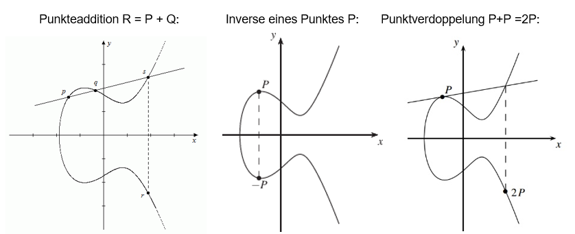

# Einführung

Neben RSA und Verfahren auf dem diskreten Logarithmusproblem sind Elliptische Kurven die dritte asymmetrische Algorithmenverfahren welche derzeit in der Praxis eingesetzt werden. Das Verfahren stammt aus den 1980-ern und bietet die gleiche Sicherheit wie die anderen beiden Verfahren \(RSA, diskret Log mit 1024-3072Bit\), jedoch mit wesentlich kürzeren Schlüsseln \(160-256Bit\) und Operanden.

Unter Elliptic Curve Cryptography \(ECC\) oder zu Deutsch Elliptische-Kurven-Kryptografie versteht man [asymmetrische Kryptosysteme](https://de.wikipedia.org/wiki/Asymmetrisches_Kryptosystem), die Operationen auf [elliptischen Kurven](https://de.wikipedia.org/wiki/Elliptische_Kurve) über [endlichen Körpern](https://de.wikipedia.org/wiki/Endlicher_K%C3%B6rper) verwenden. Diese Verfahren sind nur sicher, wenn [diskrete Logarithmen](https://de.wikipedia.org/wiki/Diskreter_Logarithmus) in der Gruppe der Punkte der elliptischen Kurve nicht effizient berechnet werden können.

Jedes Verfahren, das auf dem diskreten Logarithmus in endlichen Körpern basiert, wie z. B. der [Digital Signature Algorithm](https://de.wikipedia.org/wiki/Digital_Signature_Algorithm), das [Elgamal-Verschlüsselungsverfahren](https://de.wikipedia.org/wiki/Elgamal-Verschl%C3%BCsselungsverfahren) oder der [Diffie-Hellman-Schlüsselaustausch](https://de.wikipedia.org/wiki/Diffie-Hellman-Schl%C3%BCsselaustausch), lässt sich in einfacher Weise auf elliptische Kurven übertragen und somit zu einem Elliptic-Curve-Kryptosystem umformen.

Das Prinzip wurde Mitte der 1980er Jahre von [Victor S. Miller](https://de.wikipedia.org/wiki/Victor_S._Miller) und [Neal Koblitz](https://de.wikipedia.org/wiki/Neal_Koblitz) unabhängig voneinander vorgeschlagen.

Auf elliptischen Kurven kann eine additive [zyklische Gruppe](https://de.wikipedia.org/wiki/Zyklische_Gruppe) definiert werden, die aus den Vielfachen eines Punktes auf der Kurve, des Erzeugers der Gruppe, besteht. 

Das Addieren zweier Punkte in der Gruppe ist einfach, es gibt aber Kurven, auf denen die „Division“ zweier Punkte schwer ist.

Man unterscheidet folgende mathematischen Berechnungen:

Elliptische Kurven Kryptografie ist:

 _"One way to think of public-key cryptography is: a way to enable public-key cryptography that uses very small keys and very obscure math."_

