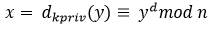

# Der RSA Algorithmus

Der Algorithmus basiert für Ver- und Entschlüsselung auf modularer Exponentiation mit den Formeln:

**Verschlüsselung:**

**Entschlüsselung:**

Dabei gilt:

* **x**: Klartext
* **y**: Chiffrat
* **n**: Modulozahl \(wird berechnet aus zwei gewählten grossen Primzahlen p und q -&gt; n = p\*q
* **kPub**: Public Key -&gt; kPu = \(n,e\) / Verschlüsselungsexponent/ öffentlicher Exponent
* **kPriv**: Private Key -&gt; kPr = \(d\) / Entschlüsselungskomponent/ privater Exponent

RSA steht und fällt jeweils mit der Auswahl von zwei Primzahlen p und q. Da diese Zahlen sehr gross sein müssen \(min. 1024 Bit\) kann man diese heutzutage nicht faktorisieren. Falls man dies könnte, wäre der RSA Algorithmus umgehend gebrochen

**Ein einfaches Beispiel:**

Gegeben ist:

* **m**: Message die verschlüsselt wird ****= Buchstaben B ist die Nummer 2 im Alphabet
* **kPu**: Public Key = 5
* **kPr**: Private Key = 11
* mod14 gewählt als Modulo

Formel zur Verschlüsselung der Nachricht durch den Sender mit dem Chiffrat **D**:

Aus B wurde somit D und dieser Cyphertext wird von Sender an den Empfänger übermittelt.

Die Rückrechnung vom Empfänger um die ursprüngliche Nachricht zu bekommen lautet:

Es ist nun sehr schwer aus obiger Formel die Nachricht m zu berechnen, wenn man in der Praxis viel grössere Zahlen verwendet als im obigen Beispiel. 

Weil der Empfänger aber den Private Key besitzt zum Public Key mit dem die Nachricht verschlüsselt wurde, kann er einfach mittels einer Umrechnungsformel die Nachricht \(Message m\) berechnen.

\*\*\*\*

