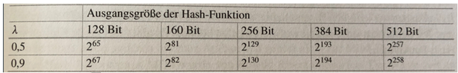

# Sicherheit

Hash Funktionen müssen drei Eigenschaften aufweisen:

1. Sie müssen Eingwegfunktionen sein \(Urbildresistenz\)
2. Sie müssen eine starke Kollisionsresistenz haben was bedeutet, dass man nicht einen zweiten Eingangswert kreieren kann welcher den gleichen Hash Wert ergibt \(Hash1 und Hash2 können erstellt werden\)
3. Schwache Kollisionsresistenz auf das zweite Urbild, was bedeutet, dass wenn man einen Hashwert hat nicht einfach den zweiten Hash Wert errechnen kann – zweite Urbildresistenz \(Hash1 ist gegeben und Hash2 kann erstellt werden\)

Wie würde eine Manipulation oder ein Angriff stattfinden? Der Angreifer würde zum Beispiel zwei Nachrichten erstellen:

* x1 = Überweise 10 CHF auf mein Konto
* x2 = Überweise 1Mio CHF auf mein Konto

x1 und x2 können manipuliert werden in dem an unsichtbaren Stellen Leerzeichen oder Tabulatoren einsetzt bis die beiden Hasehes von x1 und x2 gleich sind. Die Nachricht hat immernoch den gleichen Inhalt, weil Leerzeichen niemand identifizerit. 

Ist die Nachricht z.B 64 Bit lang, gibt es 2^64 verschiedene Hashes für die gleiche Nachricht. Intuitiv würde man sagen, dass man maximal 2^64 Hashes erstellen müsste für eine Kollision. Dem ist aber nicht so! Gemäss dem Geburtsparadox ergibt sich die Tatsache, dass man nur 2^\(n/2\) Hashes erstellen muss für eine Kollision, im Falle von 64 Bit ergibt dies ca. 2^32 Versuche, was mit einem Laptop innert Sekunden gemacht werden kann.

Das spannende in der Grafik ist, dass die Anzahl Hashwerte nicht stark von der Kollisionswarhscheinlichkeit abhängt.

Geburtstagsangriffe kann auf jede Hash-Funktion angewendet werden, jedoch ist nicht klar, ob dies der effizienteste Angriff ist. Für MD5 wie auch SHA-1 gibt es mathematische Kollisionsangriffe welche effizienter sind. Sicher gelten heute Bitlängen von mindestens 160Bit.  

