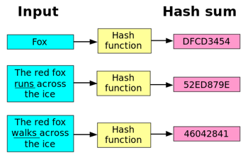

# Wie wird ein Hash gebildet

Die Idee ist, dass aus jeglichem Eingang mittels mathematischer Berechnung ein Hash Wert generiert werden kann. Egal wie gross der Eingang ist, der Ausgang soll immer gleich gross sein \(z.B 256Bit bei SHA256\).

Mathematisch betrachtet gibt es aber keine Garantie, dass jeder Hash einzigartig ist. Es kann sein, dass zwei verschiedenen Eingänge den gleichen Hash liefern \(Kollisionsresistenz\).

Das heisst, wenn die Hash Funktion 256 Bits \(n\) gross ist \(z.B SHA256\), sprich der Ausgangswert 256 Bit lang ist, gibt es 2^256 einzigartige Hashes die produziert werden können. Ist der Eingang kleiner als 256 Bit, entspricht jeder Eingang genau einem Ausgang, man hat also keine gleichen Hash-Werte h\(x\) für verschiedene Eingänge.

Ist aber der Eingan grösser als die Anzahl n-Bits der Hash Funktion, muss es zwangsläufig gleiche Hash Resultate geben für verschiedenen Eingänge. 

Dieses Problem der gleichen Hash für verschiedenen Eingänge kann theoretisch nicht gelöst werden. In der Praxis macht man das so, dass die Ausgangs-Bitlänge n so gewählt wird, dass eine rechentechnische Kollision praktisch unmöglich zu berechnen ist. 

Da diese Wahrscheinlichkeit der Kollision aber sehr klein ist, geht man in der Praxis davon aus, wenn der errechnete Hash zweier Eingänge gleich ist, die Eingänge auch gleich sind. 

