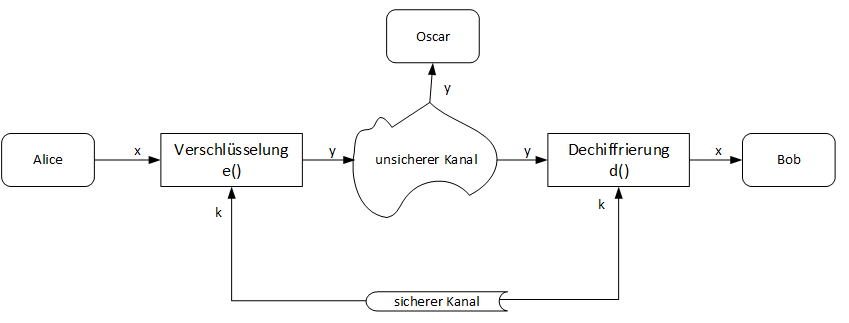

# Einführung

Bei den Symmetrischen Verschlüsselungsverfahren gibt es nur einen einzelnen Schlüssel, der für die **Ver**schlüsselung wie auch die **Ent**schlüsselung zuständig ist.  Sie ist die bekannteste und intuitivste Form der Kryptografie. Die ersten Verschlüsselungsverfahren wie Ceasar Verschlüsselung oder Vigenere waren solche Symmetrische Verfahren.

Ein klassisches Anwendungsgebiet ist die vertrauliche Kommunikation zwischen Parteien über einen unsicheren Kanal, wobei die Kommunikationspartner jeweils den Schlüssel zum Entschlüsseln haben. Wichtig ist dabei zu verstehen, dass der Schlüssel über einen **sicheren Kanal** ausgetauscht werden muss, da sonst ein Angreifer die Nachrichten mithören kann. 

Der sichere Schlüsselaustausch ist hier ein zentrales und schwieriges Problem das man jeweils lösen muss. Man kann sich das so vorstellen wie beim e-Banking. Banken schicken den Zugangscode separat per Post an den Kunden, da der Post weg als einigermassen sicher gilt. Dieser Austausch-Kanal via Post muss man in digitalen System jeweils lösen was unterschiedlich gemacht wird mit zentralen Stellen für Zertifikate oder mit [asymmetrischer Kryptografie](../asymmetrische-kryptografie/anwendung-der-asymmetrischen-kryptografie.md) \(dazu später mehr\). 

Die symmetrischen Krypto-Algorithmen unterteilen sich in die beiden Hauptfamilien:

**Blockchiffren:** Verschlüsselt einen Block aus n Bit gleichzeitig mit dem gleichen Schlüssel. Meistens sind es Blockbreiten von 128Bit \(16Byte\) wie bei dem Algorithmus AES oder 64 Bit \(8 Byte\) wie bei dem Algorithmus DES.

**Stromchiffren:**  Verschlüsselt jedes Klartextbit einzeln

Blockchiffren werden oft im Internet eingesetzt wobei Stromchiffren eher auf Anwendungen mit weniger Rechenleistung \(z.B Smartphone oder embedded Systemen\) angewendet werden.

In der heutigen Zeit nutzt und spricht man oft von folgenden Verschlüsselungsverfahren bei symmetrischer Kryptografie:

**DES** \(Data Encryption Standard\)

**Triple-DES** \(auch als TDES, 3DES oder DESede bezeichnet\)

**AES** \(Advanced Encryption Standard\)

**Vorteile der Symmetrischen Kryptografie:** 

* Einfaches Schlüsselmanagement, da nur ein Schlüssel für Ent- und Verschlüsselung benötigt wird
* Hohe Geschwindigkeit für Ent- und Verschlüsselung, da Verfahren meist auf effizienten Operationen wie Bit-Shifts und XORs aufbauen
* Symmetrische Verfahren sind robuster gegen Quantencomputer Angriffe

**Nachteile der Symmetrischen Kryptografie:**

* Nur ein Schlüssel für Ver- und Entschlüsselung, Schlüssel darf nicht in unbefugte Hände gelangen
* Schlüssel muss über einen sicheren Weg übermittelt werden
* Anzahl der Schlüssel bezogen auf die Anzahl der Teilnehmer wächst quadratisch

