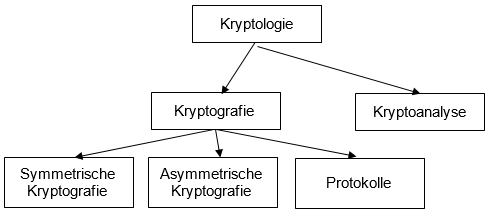

# Genereller Überblick

Die Kryptologie besteht aus zwei Teilen:

**Kryptografie:** Absicherung Verschlüsselung von Informationen

**Kryptoanalyse:** Brechen von Verschlüsselungen

Die **Kryptografie** ist somit ein Teil der **Kryptologie.**

Grundsätzlich geht es immer um das Thema, wie man über eine unsichere Leitung eine Nachricht austauschen kann und sicherstellt, dass die geheimen Schlüssel von keinem Angreifen benutzt werden können.

In der modernen Kryptografie gibt es nicht sehr viele Verfahren welche auch in der Praxis genutzt werden, weil es sehr schwierig ist solche System robust und gleichzeitig nutzbar zu machen. Zudem werden für verschiedene Anwendungen verschiedenen Verfahren genutzt wie zum Beispiel:

**Hash Funktion:** Damit werden die eigentliche Nachricht verschlüsselt

**Signaturen:** Damit wird die Nachricht signiert und identifiziert ob diese nicht manipuliert wurde und ob der Sender auch tatsächlich der korrekte Absender war.

Bei der Signatur gibt es in der modernen Kryptografie zwei Hauptgruppen:

**Symmetrische Verfahren:** Schlüssel zum Ver- und Entschlüsseln ist identisch

**Asymmetrische Verfahren:** Schlüssel zum Ver- und Entschlüsseln ist verschieden. Hierzu werden Public Key - Private-Key Verfahren genutzt.

Auf die Unterteilung der Symmetrischen Verfahren nach Block Chiffren und Strom Chiffren wird hier verzichtet. Grundsätzlich gilt aber:

**Stromchiffren:** Klartext wird Zeichen für Zeichen verschlüsselt 

**Blockchiffren:** Feste Blockgrössen in einem Schritt verschlüsselt \(mehrere Zeichen gleichzeitig\)

